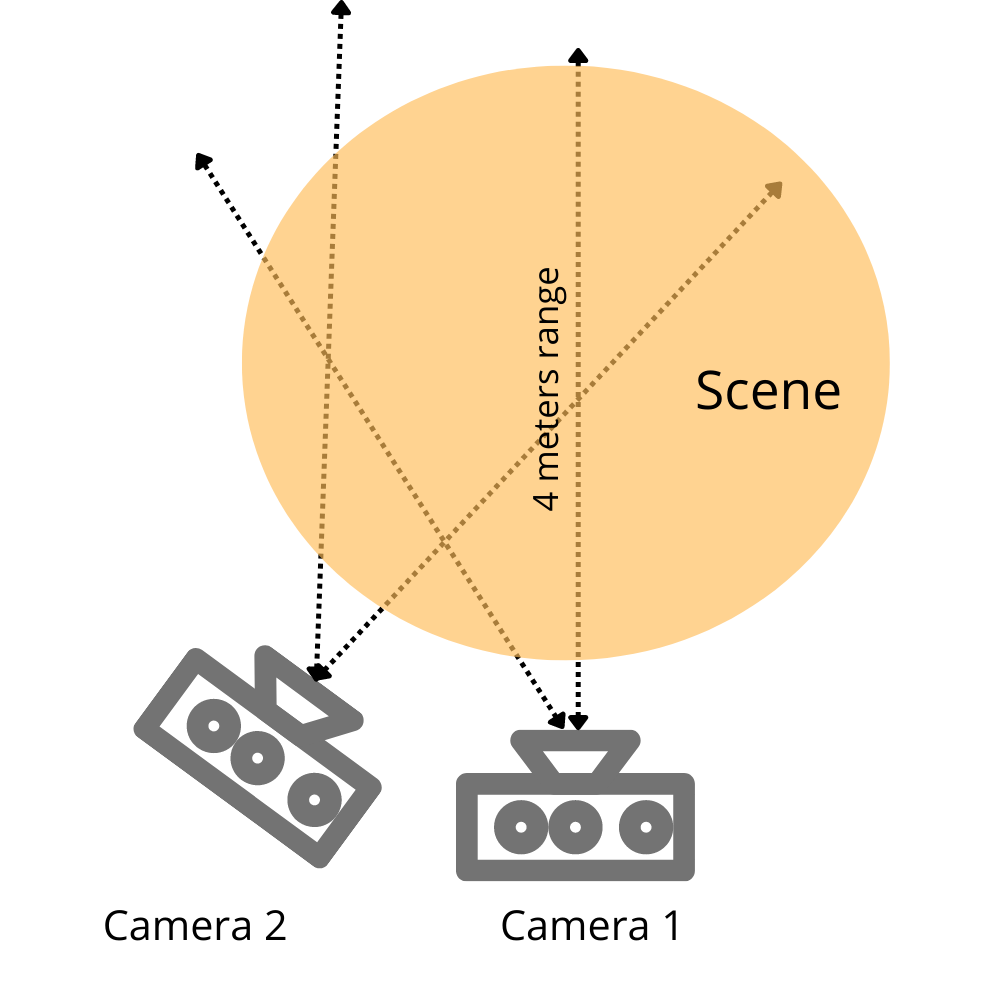

# RGB-D-Theatre-Scenes-Dataset
[arXiv Preprint](https://doi.org/10.48550/arXiv.2308.01035)

In this repository, you will find a Python code that allowed us to record depth, RGB, and Skeletal data using Kinect v1.
You will also find scenarios that were interpreted by a group of computer science students in the auditorium of the University of Sciences and Technologies Houari Boumediene (USTHB), Algeria.
In the end, recorded frames can be found in the folders: RGB_images, Depth_data, and Skeleton_data.
Depth is saved to JPEG images after normalization.
Two Kinect cameras were placed at different positions to guarantee more diversity in the angles of taken images.

# Requirements
  - Microsoft Kinect v1
  - Windows 10
  - Kinect Windows SDK v1.8
  - python 2.7
  - pykinect
  - OpenCV
 
 # Notes
 For each recorded scene there are 3 folders: one for depth frames, the second for RGB frames and the third for skeletons.
 The dataset is organized as follows:
  - For sequences: the folder name contains the number of the camera C, the scene number S, then the take number T <C..S..T..>
  - For actions: the folder name contains the same information as sequence except we added the number of the actor P <C..P..A..T..>

# Action classes
This dataset provides 36 action classes including single person actions and two-person interactions. The actions are labeled as shown bellow:

|Action label|      Action class     |Action label|         Action class         |Action label|                Action class               |
|------------|-----------------------|------------|------------------------------|------------|-------------------------------------------|
|     01     | Standing up           |     13     | Putting on a jacket          |     25     | Salute                                    |
|     02     | Bowing                |     14     | Taking off a jacket          |     26     | Putting palms together                    |
|     03     | Sitting down          |     15     | Putting on shoes             |     27     | Falling down                              |
|     04     | Drinking              |     16     | Taking off on shoes          |     28     | Fan self                                  |
|     05     | Eating                |     17     | A person walking             |     29     | Pushing a person                          |
|     06     | Dropping something    |     18     | Handwaving                   |     30     | Punch/slap a person                       |
|     07     | Picking up something  |     19     | Touch head                   |     31     | Two persons hugging                       |
|     08     | Throwing something    |     20     | Phone call                   |     32     | Giving something to someone               |
|     09     | Clapping              |     21     | Jumpping                     |     33     | Shaking hands                             |
|     10     | Reading               |     22     | Kicking something or someone |     34     | High five                                 |
|     11     | Writing               |     23     | Cheking time on a wristwatch |     35     | Two persons walking towards each other    |
|     12     | Tearing up paper      |     24     | Wipe face                    |     36     | Two persons walking apart from each other |

 
 # Download Links
 Here are links to download raw data, and the link for selected and annotated images for the task of image captioning:
  - [Camera 1 Data](https://drive.google.com/drive/folders/19AHzZdrccA3IBmkZ-UQ_BIknK_4EozUo?usp=sharing)
  - [Camera 2 Data](https://drive.google.com/drive/folders/1aDHcl8zsBLjVrAiwIfAsq5yq3ypEW7jJ?usp=sharing)
  - [Selected Images](https://drive.google.com/drive/folders/1h24jRsH9dGBxGOhaJq1W4ujKGT9AvtqQ?usp=sharing) 
 
 
 
